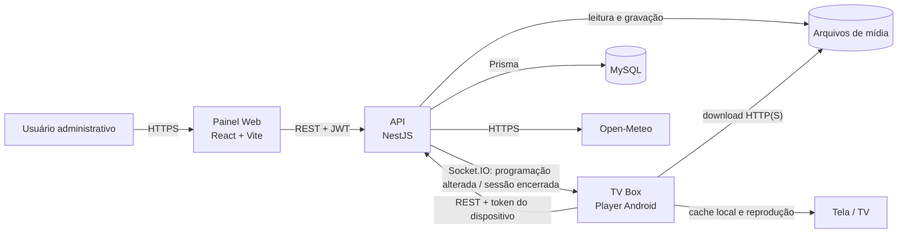

# Arquitetura da solução

## Visão geral

O Indoor Player utiliza uma arquitetura cliente-servidor com três aplicações implantáveis separadamente. A API é a fonte de verdade para dados administrativos e programação. O painel Web consome a API para gestão. O Player Android sincroniza a programação, baixa os arquivos necessários e executa a reprodução localmente.

## Componentes

### Painel Web

- Single Page Application gerada pelo Vite.
- Interface para dashboard, dispositivos, mídias, playlists, barras fixas, agendamentos, usuários e auditoria.
- Autenticação por JWT enviado no cabeçalho `Authorization: Bearer`.
- Token e usuário armazenados em cookies acessíveis pelo JavaScript por um dia.
- Rotas carregadas sob demanda e protegidas por autenticação; usuários e auditoria exigem perfil `OWNER` ou `ADMIN`.
- Build estático publicado por Nginx, Apache, CDN ou serviço equivalente, sempre com fallback para `index.html`.

### API

- Aplicação NestJS sem prefixo global de rota.
- Validação global de DTOs com remoção de campos desconhecidos e rejeição de propriedades não permitidas.
- Persistência MySQL por Prisma e migrations versionadas.
- Armazenamento de mídias em diretório do sistema de arquivos exposto por rota pública configurável.
- Comunicação Socket.IO no namespace `/devices`, somente por WebSocket.
- Cálculo da programação no fuso fixo `America/Fortaleza`.
- Integração com Open-Meteo para clima, com cache em memória por 15 minutos.
- Isolamento lógico por `companyId` nas consultas autenticadas.

### Player Android

- Aplicativo React Native com módulos nativos Kotlin/Java para orientação e HDMI-CEC.
- Registra o dispositivo, exibe um código de vínculo e obtém um token exclusivo após o pareamento.
- Sincroniza uma janela de programação de 24 horas a cada 15 segundos e também quando recebe um evento em tempo real.
- Baixa mídias para armazenamento privado, com até três downloads concorrentes.
- Mantém programação, posição de reprodução e arquivos localmente para retomar após reinício ou perda de conexão.
- Envia heartbeat a cada 10 segundos com a mídia atual, posição, duração e estado de áudio.
- É iniciado automaticamente após boot quando o firmware permite o recebimento de `BOOT_COMPLETED`.

## Comunicação e protocolos

| Origem    | Destino         | Protocolo           | Autenticação               | Finalidade                          |
| --------- | --------------- | ------------------- | -------------------------- | ----------------------------------- |
| Navegador | Web             | HTTPS               | —                          | Carregar a SPA                      |
| Web       | API             | HTTPS/JSON          | JWT de usuário             | Gestão e consultas                  |
| Player    | API             | HTTP(S)/JSON        | Token do dispositivo       | Programação e heartbeat             |
| Player    | API             | WebSocket/Socket.IO | Token no handshake         | Notificação de mudança e desvínculo |
| Player    | Arquivos da API | HTTP(S)             | Rota pública               | Download de imagens e vídeos        |
| API       | MySQL           | TCP                 | Credencial do banco        | Persistência                        |
| API       | Open-Meteo      | HTTPS               | Opcional conforme provedor | Geocodificação e clima atual        |

## Disponibilidade e modo offline

O Player foi desenhado para continuar reproduzindo conteúdo já sincronizado quando a API ou a rede estiver indisponível. A programação e o estado da playlist são persistidos no `AsyncStorage`; as mídias ficam no diretório privado `player-media`. Uma atualização só é ativada após os arquivos necessários serem preparados. Arquivos sem uso são removidos pelo gerenciador de cache.

Limitações do modo offline:

- uma programação nunca sincronizada não pode ser recuperada sem a API;
- widgets de clima dependem de atualização externa, embora o último conteúdo renderizado possa permanecer durante a sessão;
- alterações administrativas só chegam após restabelecer REST ou Socket.IO;
- heartbeat, status online e prévia ao vivo deixam de ser atualizados.

## Tempo real e consistência

Mudanças em agendamentos, playlists e barras notificam os players afetados por Socket.IO. A notificação não transporta toda a programação: ela solicita uma nova sincronização REST. Como proteção contra perda do evento, o Player também sincroniza periodicamente.

A resposta de programação contém uma versão SHA-256 calculada sobre ocorrências e conteúdo. O Player compara assinaturas antes de reutilizar a programação local ou baixar novamente os arquivos.

## Multiempresa

Usuários, dispositivos vinculados, mídias, pastas, playlists, barras e agendamentos pertencem a uma empresa. O `companyId` do usuário autenticado é obtido do JWT e confirmado no banco. As operações administrativas filtram os registros por esse identificador. O token do dispositivo também resolve o `companyId` do player vinculado.

O isolamento é aplicado na camada de serviço; não existe um banco ou schema separado por empresa.

## Persistência

| Dado                     | Local                           | Observação                                      |
| ------------------------ | ------------------------------- | ----------------------------------------------- |
| Cadastro e configuração  | MySQL                           | Gerenciado por Prisma migrations                |
| Logs de dispositivo      | MySQL                           | Tabela `DeviceLog`                              |
| Arquivos enviados        | Sistema de arquivos da API      | Não são armazenados no MySQL                    |
| Cache de clima           | Memória da API                  | Expira em 15 minutos e não sobrevive a reinício |
| Credenciais do Player    | AsyncStorage                    | Código, segredo de ativação e token             |
| Programação e reprodução | AsyncStorage                    | Permite retomada local                          |
| Cache de mídia do Player | Diretório privado do aplicativo | Nome versionado pelo conteúdo                   |

## Escalabilidade atual

A topologia atual favorece uma implantação simples em um único servidor. Para executar múltiplas instâncias da API será necessário, antes:

- mover as mídias para armazenamento compartilhado ou object storage;
- adicionar um adapter compartilhado ao Socket.IO, como Redis;
- garantir afinidade ou distribuição correta das conexões WebSocket;
- substituir caches exclusivamente em memória quando consistência entre instâncias for necessária;
- centralizar logs e métricas.
