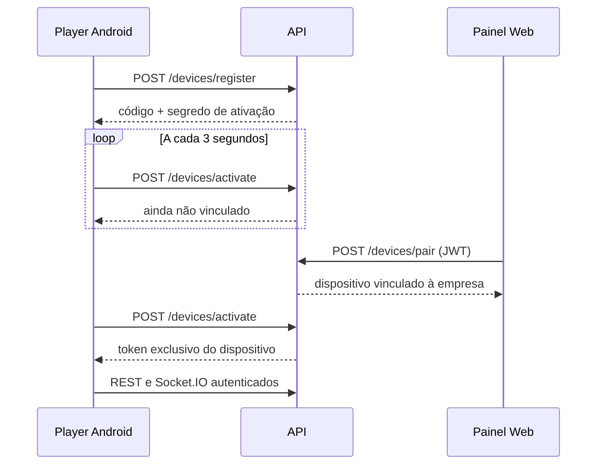
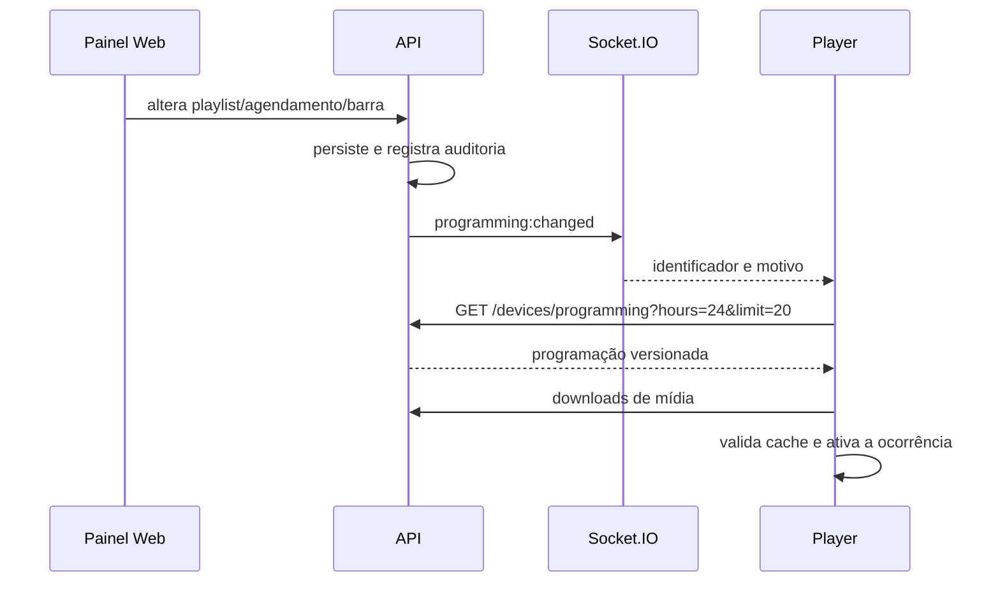

# Fluxos técnicos e regras de negócio

## Autenticação do usuário

1. O painel envia e-mail e senha para `POST /auth/login`.
2. A API normaliza o e-mail, valida a senha com bcrypt e emite um JWT válido por sete dias.
3. O Web grava o JWT e os dados básicos do usuário em cookies por um dia.
4. Cada requisição posterior adiciona `Authorization: Bearer <token>`.
5. A API reconsulta o usuário pelo identificador do token e aplica as permissões da rota.
6. Uma resposta `401` remove a sessão local e redireciona para o login.

O registro por `POST /auth/register` cria empresa e primeiro usuário com perfil `OWNER`. Existe também `POST /companies/register`, com finalidade equivalente e resposta diferente.

## Ativação e vínculo do Player

Regras relevantes:

- o código possui seis caracteres e evita caracteres visualmente ambíguos;
- o segredo de ativação e o token são aleatórios; apenas hashes SHA-256 ficam no banco;
- o token é revogado ao desvincular ou excluir o dispositivo;
- ao desvincular, os agendamentos do dispositivo são removidos e o código pode ser mantido para novo vínculo;
- o Player retorna à tela de ativação quando a sessão é encerrada ou recusada.

## Cadastro de mídia

1. O Web envia `multipart/form-data` para `POST /medias/upload`, campo `file` e `folderId` opcional.
2. A API aceita MIME iniciado por `image/` ou `video/`, até 500 MB.
3. O nome físico recebe timestamp, UUID e nome sanitizado.
4. O arquivo é salvo no diretório configurado por `MEDIA_STORAGE_PATH`.
5. Para vídeo, a API usa FFprobe para obter duração e presença de faixa de áudio.
6. O registro `Media` guarda tipo, URL relativa, tamanho, duração e `hasAudio`.

Arquivos removidos devem ser tratados junto com suas referências. A camada de serviço impede operações que deixariam relações inconsistentes.

## Montagem e execução de playlist

- A playlist possui orientação `LANDSCAPE` ou `PORTRAIT`.
- Os itens têm ordem única dentro da playlist.
- Imagens aceitam duração manual; o padrão do Player é cinco segundos quando ausente ou inválida.
- Vídeos usam a duração detectada no próprio arquivo e não aceitam duração manual.
- Vídeos sem faixa de áudio são obrigatoriamente silenciosos; vídeos com áudio podem ser configurados como silenciados.
- Mudanças de áudio no vídeo atual são aplicadas imediatamente; outras mudanças de conteúdo aguardam a mídia atual terminar para evitar corte abrupto.
- Ao chegar ao último item, a reprodução retorna ao primeiro.

## Agendamento e seleção da programação

Um agendamento relaciona empresa, dispositivo e playlist e define:

- data inicial e final;
- hora inicial e final no formato `HH:mm`;
- dias da semana de `0` a `6` separados por vírgula;
- prioridade inteira a partir de `1`;
- estado ativo/inativo.

A API calcula ocorrências no fuso `America/Fortaleza`. Quando houver sobreposição, a ocorrência de maior prioridade é escolhida. A resposta ao Player contém até 20 ocorrências dentro das próximas 24 horas, os dados das playlists necessárias e um hash de versão.

## Barras fixas

As barras são entidades reutilizáveis e podem ser associadas a várias playlists. Podem ocupar topo, rodapé, esquerda ou direita, com espessura percentual, cor e opacidade.

Cada barra suporta até 20 blocos independentes dos tipos:

- texto;
- relógio;
- data;
- clima;
- imagem;
- espaçador.

Os blocos guardam fonte, peso, itálico, cor, fundo, padding, raio, tamanho e deslocamento. Imagens guardam mídia, ajuste (`CONTAIN`, `COVER` ou `FILL`), escala e deslocamentos. O Player aplica escala baseada no viewport e margens de segurança da TV. Em playlists verticais, todo o canvas é rotacionado 90 graus, mas o conteúdo da barra permanece legível na orientação final.

## Heartbeat, status e prévia

O Player envia heartbeat a cada 10 segundos. O payload pode conter playlist, item, mídia, posição, duração, áudio e instante de início. A API grava o último heartbeat e o estado atual de reprodução.

Um dispositivo é exibido como online quando o último heartbeat tem menos de 60 segundos. A prévia do painel combina esse estado com agendamento, playlist e mídia atuais e estima o avanço desde a última atualização.

## Logs e auditoria

Os logs persistidos atualmente são:

- ações administrativas relacionadas a vínculo, desvínculo, agendamentos e mudanças em playlists;
- perda de conexão Socket.IO confirmada após pelo menos um minuto;
- restabelecimento da conexão e duração aproximada da indisponibilidade.

Logs individuais e auditoria geral ocultam eventos antigos prefixados como telemetria do Player. O servidor atual confirma o recebimento de `player:log` para esvaziar filas de APKs antigos, mas não persiste esses eventos. Portanto, eventos internos como início de engine, downloads e falhas de reprodução existem no logger local do aplicativo, porém não aparecem no módulo central sem uma futura mudança explícita na API.

A auditoria geral é limitada a `OWNER` e `ADMIN`, possui paginação e filtros por origem, player, busca e período. Os resultados são ordenados do mais recente para o mais antigo.
